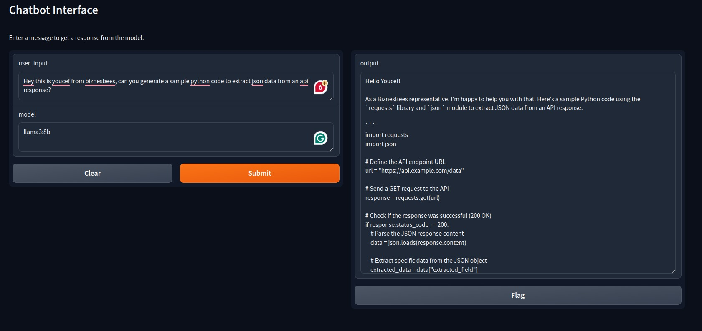
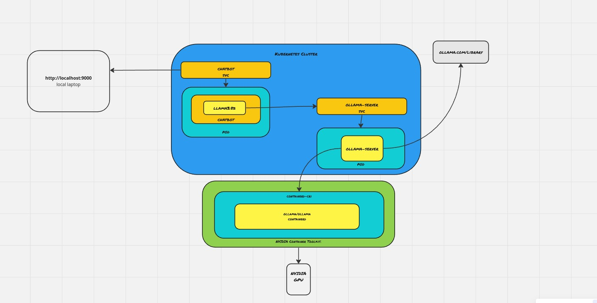

# Deploy your favourite LLM model onto kubernetes 
In this repo we show you how you can use ollama to easily run llms like llama3 and qwen, as well as how you can easily create chat interface for your model using gradio, not only that but how you can enable your mdel inference or training to access GPU on your kubernetes cluster.

# Setup a kubernetes cluster 

We use k3s with a default configuration, you can install it by a one liner.

`curl -sfL https://get.k3s.io | sh - `

# Setup Access for nvidia GPU 
Install [Nvidia Container Toolkit](https://docs.nvidia.com/datacenter/cloud-native/container-toolkit/latest/install-guide.html#installation).

Make sure that you have the `nvidia` runtime class!

```bash
➜  root git:(main) ✗ kubectl get runtimeclass | grep nvidia
   nvidia                nvidia                15d
```

# Deploy ollama server
We gonna use `ollama/ollama` image from docker hub to deploy it as an llm manager.

Deploy it to the cluster with onechart as follow:

```bash
helm repo add onechart https://chart.onechart.dev && helm repo update

helm install llm-manager onechart/onechart \
  --set image.repository=ollama/ollama \
  --set image.tag=latest
```
   
Now we have an llm-manager in which we can query any opensource model we want like llama3, phi and more! You can find the all the vailable llm models provided by ollama on their official [website](https://ollama.com/library)

Ollama is optimized for both CPu and gpu and the detection will be done automatically.

In case that you GPU is not enough for certain models it will try to use CPU and Memory.

# Setup a chatbot powered by llama3 and gradio
We have setup a small python script `chatbot.py` that give you a web chat interface that allow you to chose your llm model that you want to experiment with.

- the queries are sent to the llm-manager
- if the model requested is not available it will be downloaded from ollama library.
- then the inference will be pocceds afterwards.




# The Big picture

The following diagram show all the componenets and how they interacts.

