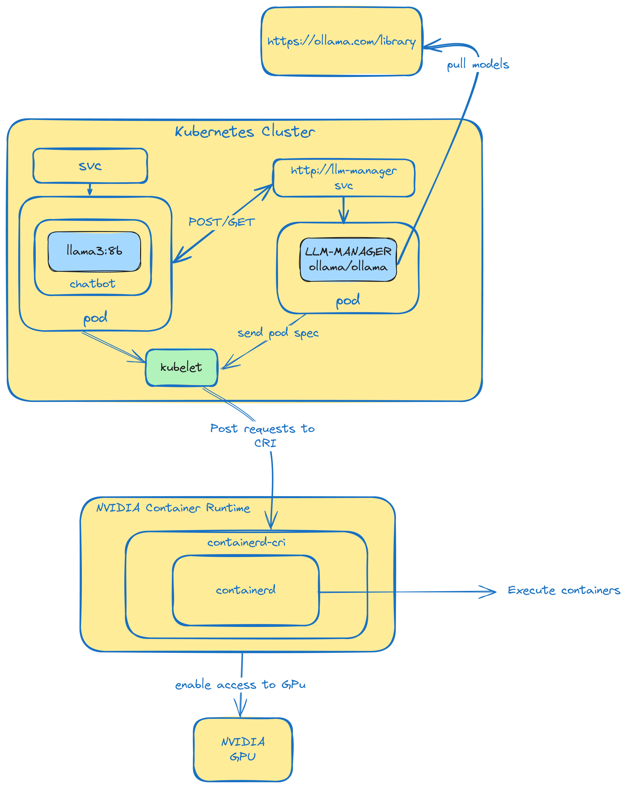
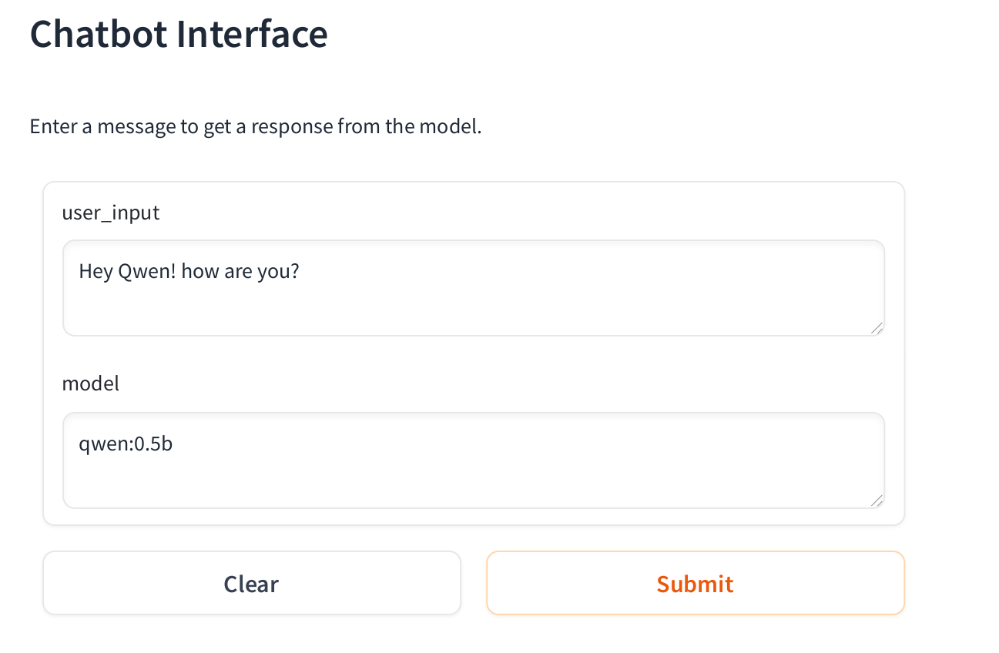
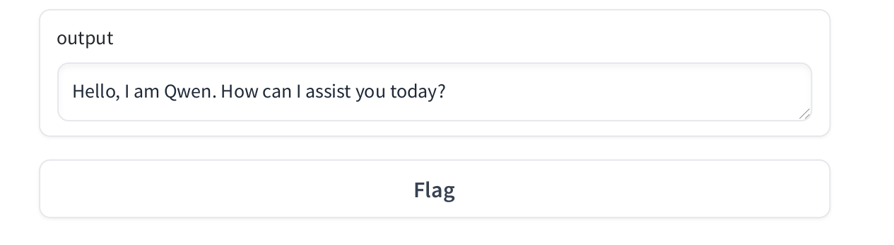

# Spin Up Your Own Chatbot Powered by famous llms like llama3, phi .. on your Own cluster on your own laptop!—All in Just a Few Steps!



In this blog post we gonna go through how you can deploy your ml workloads onto kubernetes and enable GPU acceleration for it.

Before dig in into the pratical part, we want to dig in a bit on what's happening under your kubernetes cluster, Some of us are always curious how thing are beind handled behind the scenes.

Shall we ?

#### What is container runtime
Container runtime in a nutshell is the peace of software that is responsible for executing containers and managing their lifecycle.

Container runtime handles tasks such as pulling container images, creating and starting containers, and managing the resources and isolation for each container.

Alright now we said that, what is the relation between your cluster, your pod and the container runtime?

We are getting there in a moment!
#### Kublet, Pod, CRI and container runtime

When you deploy your pod to your cluster, the kublet (kubelet is a core componenet on kubernetes that is responsible for the whole pod lifecycle)will receive the pod spec from the cluster's API server.

In the podspec we will have info like image right? let's say the image is nginx, kublet will post a request to the container runtime that i want to run an nginx image, how does kublet commuicate with the container runtime? it will use what called CRI (Container Runtime Interface).

CRI is a standard api that allows kubelet to interact with the container runtime in a consistent manner.

After the kublet submit the request to CRI, the container runtime will pull the image and run it based on the specification sent by the kublet, then the kublet will receive back the status from the container runtime through CRI and display for us that the pod is running succesfully, kublete can send termination request and restarts .. etc 


Does container runtime like containerd have capabilities to use GPU natively? the simple ansewr is no! Then how you enable GPU access to your workloads?

#### What is nvidia container runtime ?
Nvidia Container Runtime is a wrapper that wrao the container runtime, with cababilities of accesiing GPU resources on the host machine, so when your workload that is running inside standard runtime like containerd request GPU acceleration, Nvidia container runtime will allow the container runtime to use the provided GPUs in the host machine.

that's in short was the story from your pod to your GPU!

Let's now get our hands dirty shall we?

### Setup Cluster
First we have to install nvidia container toolkit, it has nvidia container runtime along with other packages that enable container runtime to access gpus, for k3s case it uses conatinerd as the default container runtime.

Please check the official nvidia docs on how you can install the nvidia container toolkit, and configure it with `containerd` -> [installation](https://docs.nvidia.com/datacenter/cloud-native/container-toolkit/latest/install-guide.html)

Hey welcome back!

Alright now we can spin up our cluster, we chose to use k3s for this blog post, the installation is one liner as follows:
`curl -sfL https://get.k3s.io | sh - `

Test if the cluster is up and running

```bash
➜  sudo k3s kubectl get nodes
NAME      STATUS   ROLES                  AGE   VERSION
node-01   Ready    control-plane,master   15d   v1.29.4+k3s1
```
if you want to get rid of the `sudo k3s` you can do the following: 

```
sudo chmod 644 /etc/rancher/k3s/k3s.yaml
export KUBECONFIG=/etc/rancher/k3s/k3s.yaml
kubect get nodes
```

Yay our cluster is ready!

### Deploy ollama as a central llm-manager
Ollama is a new project that allows to use llms like llama3 on your local computer, it is optimized for CPUs as well, it automatically chose the perfect fit for your workloads, in cas that your GPU memory is not enough it will switch automatically to use CPU.

deploy with onechart

```
helm repo add onechart https://chart.onechart.dev && helm repo update
helm install llm-manager onechart/onechart \
  --set image.repository=ollama/ollama \
  --set image.tag=latest \
  --set containerPort=11434 \
  --set podSpec.runtimeClassName=nvidia
```

Ollama expose port `11434` bu default, we also set the `runtimeClassName` to `nvidia` to benefit from the nvidia container runtime for GPU acceleration workloads.

```
root git:(main) ✗ kubectl get po,svc | grep llm-manager
pod/llm-manager-665765c8df-8pnz7               1/1     Running                    3 (5h19m ago)    39h
service/llm-manager               ClusterIP   10.43.240.248   <none>        80/TCP              4d22h
```
If we check the logs, we will see that it will detect a GPU if you have one.
In my case it is an `NVIDIA GeForce RTX 2060` 
```
root git:(main) ✗ kubectl logs llm-manager-665765c8df-8pnz7
time=2024-05-19T07:34:34.379Z level=WARN source=amd_linux.go:163 msg="amdgpu too old gfx000" gpu=0
time=2024-05-19T07:34:34.379Z level=INFO source=amd_linux.go:311 msg="no compatible amdgpu devices detected"
time=2024-05-19T07:34:34.379Z level=INFO source=types.go:71 msg="inference compute" id=GPU-2607f162-ae64-a3c2-13dc-0fe25020d136 library=cuda compute=7.5 driver=12.4 name="NVIDIA GeForce RTX 2060" total="5.8 GiB" available="5.7 GiB"
```

Next step we will create a client pod that will interacts with the llm-manager.


### Setup a chatbot powered by llama3 and gradio
We already created a simple python code and package it under `ghcr.io/biznesbees/chatbot-v0.1.0`.

Please refere to the source code here: [github/chatbot-v0.1.0](https://github.com/biznesbees/deploy-gpu-based-ml-workloads-to-k8s)

What this image do?
- It run a web interface powered by gradio
- It will post a request for the llm-manager to pull a certain llm model if it is not avaialable
- Post text inputs
- Receive answers from the chosen llm

Let's deploy our chatbot and start doing some magic!

```
helm install chatbot onechart/onechart \
  --set image.repository=ghcr.io/biznesbees/chatbot-v0.1.0 \
  --set image.tag=latest \
  --set vars.OLLAMA_HOST=http://llm-manager \
```
the code anticipate an env var `OLLAMA_HOST` set to the llm-manager since the chatbot will send requests there!

After the installations succeded!

Let's port forward the chatbot to our local machine and access it through the broswer.

```
➜ root git:(main) ✗ kubectl port-forward svc/chatbot 8080:80
Forwarding from 127.0.0.1:8080 -> 80
Forwarding from [::1]:8080 -> 80
```
I think we are ready to test the our chatbot!!


### Run experiments
Alright we gonna perform two experiments:

#### 1. qwen:0.5b

As you see we specified the Qwen Model with half billion parameters, When we hit submit the llm-manager will download first the model if it doesn't exist.

We can check the logs of the llm manager

```bash
root git:(main) ✗ kubectl logs llm-manager-665765c8df-8pnz7
time=2024-05-19T13:45:50.851Z level=INFO source=download.go:136 msg="downloading fad2a06e4cc7 in 4 100 MB part(s)"
time=2024-05-19T13:47:15.893Z level=INFO source=download.go:136 msg="downloading 41c2cf8c272f in 1 7.3 KB part(s)"
time=2024-05-19T13:47:19.053Z level=INFO source=download.go:136 msg="downloading 1da0581fd4ce in 1 130 B part(s)"
time=2024-05-19T13:47:22.141Z level=INFO source=download.go:136 msg="downloading f02dd72bb242 in 1 59 B part(s)"
time=2024-05-19T13:47:25.217Z level=INFO source=download.go:136 msg="downloading ea0a531a015b in 1 485 B part(s)"

```

After the download completes we will get an answer from the qwen model as you see in the image
and it will use the provided GPU.




to check GPU usage type nvidia-smi
```
➜  ~ nvidia-smi
+-----------------------------------------------------------------------------------------+
| NVIDIA-SMI 550.54.15              Driver Version: 550.54.15      CUDA Version: 12.4     |
|-----------------------------------------+------------------------+----------------------+
| GPU  Name                 Persistence-M | Bus-Id          Disp.A | Volatile Uncorr. ECC |
| Fan  Temp   Perf          Pwr:Usage/Cap |           Memory-Usage | GPU-Util  Compute M. |
|                                         |                        |               MIG M. |
|=========================================+========================+======================|
|   0  NVIDIA GeForce RTX 2060        Off |   00000000:01:00.0 Off |                  N/A |
| N/A   54C    P3             17W /   90W |     950MiB /   6144MiB |      6%      Default |
|                                         |                        |                  N/A |
+-----------------------------------------+------------------------+----------------------+
                                                                                         
+-----------------------------------------------------------------------------------------+
| Processes:                                                                              |
|  GPU   GI   CI        PID   Type   Process name                              GPU Memory |
|        ID   ID                                                               Usage      |
|=========================================================================================|
|    0   N/A  N/A      8748      G   /usr/lib/xorg/Xorg                              4MiB |
|    0   N/A  N/A    348592      C   ...unners/cuda_v11/ollama_llama_server        942MiB |
```
- The second one will be with llm model `llama3:8b` an it will use CPU since the provided GPU is not enough.

#### 1. llama:8b

Second option is to use llama3 with 8 billion parameters, since the GPU provided can handle llama:8b, it will optimize the inference for the CPU.

we gonna replicate the same proccess, but this time we gonna check CPU usage at inference time.